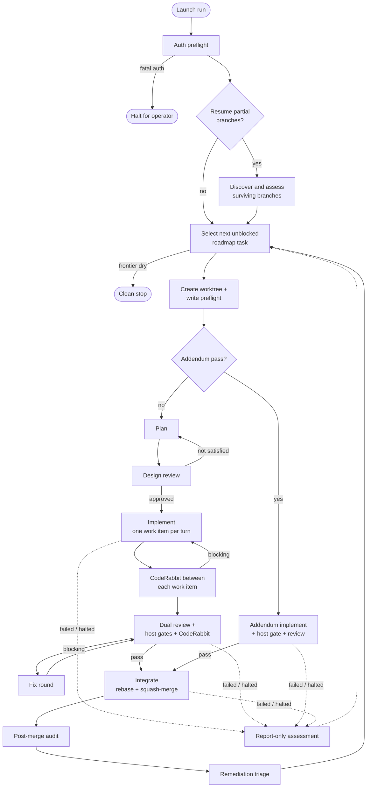

# df12-build

*Happy robots build happy code!*

`df12-build` is the workflow and operator-guidance home for df12-style roadmap
workshops. It helps an operator drive a target project from a GIST roadmap
through planning, review, implementation, gates, integration, audit, and
recovery.

______________________________________________________________________

## Why df12-build?

Long-running agent workshops need more than a prompt and good intentions.
`df12-build` gives operators a repeatable shape for that work:

- **Durable launch state**: keep live run-control files in a `.workshop`
  sidecar, outside both the workflow repository and the target project.
- **Roadmap-driven execution**: select unblocked GIST roadmap tasks from
  `origin/<base>` rather than transient local edits.
- **Parallel but gated work**: let independent task agents work concurrently
  while serializing integration through the workflow host.
- **Recovery evidence**: assess surviving task branches without treating
  transient agent transcripts as the source of truth.

______________________________________________________________________

## Quick start

### Installation

Clone this repository and make sure the df12 toolchain,
[Open Dynamic Workflows (ODW)](https://github.com/xz1220/open-dynamic-workflows),
Codex and Claude adapters, Git, Node.js, `markdownlint-cli2`, and
`nixie` are available on the machine that will supervise the workshop.

Verify the checked-in workflow assets before launching a workshop:

```bash
make all
```

The Markdown gate refreshes the shared en-GB-oxendict dictionary when newer,
regenerates `typos.toml`, and checks maintained prose with a pinned `typos`
release. A valid committed config remains usable without network access.

### Basic usage

Create a sidecar next to the target project, copy the ODW workflow into it,
write the run configuration, then launch the copied workflow with the target
project as `--source`:

```bash
PROJECT=/data/leynos/Projects/example-project
RUN_ID="$(date -u +%Y%m%dT%H%M%SZ)-$$"
SIDECAR="${PROJECT}.workshop/df12-build-${RUN_ID}"

mkdir -p "$SIDECAR"
cp workflows/df12-build-odw.js "$SIDECAR/df12-build-odw.js"

# Author these before launching — the run will not start without them.
# docs/users-guide.md carries a complete odw.config.json shape (adapters,
# concurrency, timeout) and the args.json argument reference.
"$EDITOR" "$SIDECAR/odw.config.json"
"$EDITOR" "$SIDECAR/args.json"

odw run "$SIDECAR/df12-build-odw.js" \
  --source "$PROJECT" \
  --config "$SIDECAR/odw.config.json" \
  --args @"$SIDECAR/args.json"
```

The sidecar should also contain `operator-notes.md`, where the operator records
the run id, launch command, local sidecar patches, validation notes, health
checks, failures, and decisions.

______________________________________________________________________

## Features

- ODW/Codex workflow for df12-house roadmap workshops.
- Deterministic roadmap task and addendum selection.
- Sidecar launch model for durable run-control artefacts.
- Planning, design review, implementation, gate, review, integration, audit,
  and remediation phases.
- Report-only assessment of failed or halted task branches that still have
  useful durable evidence.
- Documentation for launch, architecture, security, permissions, and
  contributor workflow maintenance.

______________________________________________________________________

## How the workflow runs

For each unblocked roadmap task the host creates an isolated git worktree,
verifies the task agent can write into it, then drives the task through
planning, implementation, review, and integration — serializing only the
steps that advance `origin/<base>`. Failed or halted branches are assessed
report-only rather than discarded.



______________________________________________________________________

## Related projects

- [Open Dynamic Workflows (ODW)](https://github.com/xz1220/open-dynamic-workflows)
  — the TypeScript CLI runtime that executes the `df12-build-odw.js` workflow
  across Codex, Claude Code, and other coding-agent CLIs.
- [df12-documentation-skills](https://github.com/leynos/df12-documentation-skills)
  — the df12 documentation authoring skills these guides follow.
- [agent-helper-scripts](https://github.com/leynos/agent-helper-scripts)
  — helper scripts and skills (including the `odw-*` authoring, testing, and
  supervision skills) run by the supervising agent.

______________________________________________________________________

## Learn more

- [Users' Guide](docs/users-guide.md) — launch and supervision instructions.
- [Developers' Guide](docs/developers-guide.md) — changing workflow assets.
- [Architecture](docs/architecture.md) — state boundaries and host contracts.
- [Security and Permissions](docs/security-and-permissions.md) — runtime access
  and sandbox guidance.
- [Roadmap](docs/roadmap.md) — planned recovery and continuation work.

______________________________________________________________________

## Licence

ISC — see [LICENSE](LICENSE) for details.

______________________________________________________________________

## Contributing

Contributions welcome. Please read [AGENTS.md](AGENTS.md) and
[Developers' Guide](docs/developers-guide.md) before editing workflow files or
documentation.
