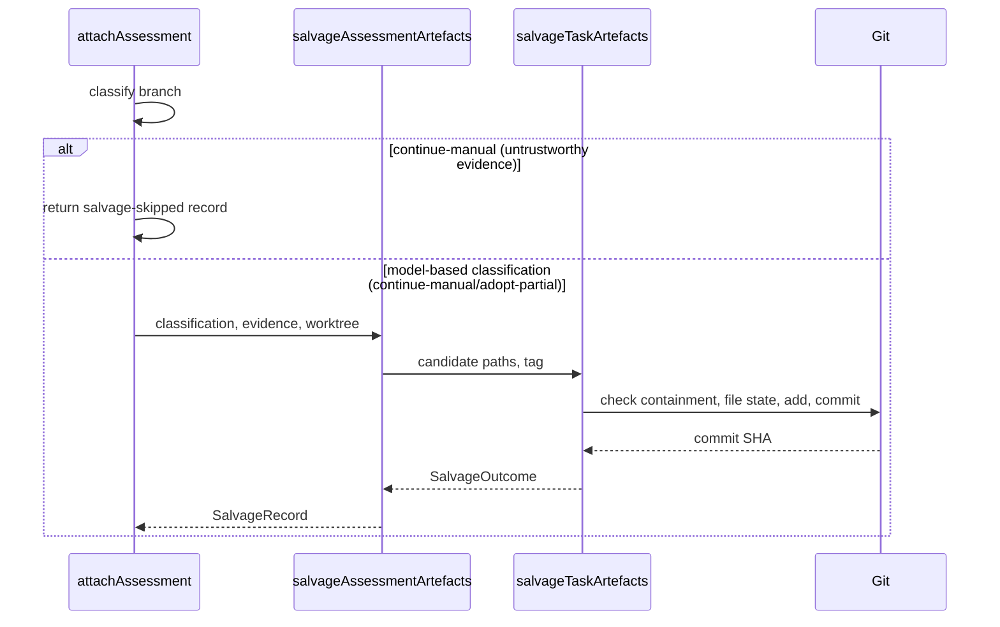

# ADR 002: Assess partial task branches before fresh restart

## Status

Accepted and implemented for the ODW workflow.

## Date

2026-06-30.

## Context and problem statement

`df12-build` is intentionally restartable from target-project Git state. A
failed ODW run should not depend on transient agent transcripts, host context,
or adapter-local session state. The recovery source of truth is the target
project's `origin/<base>` plus any surviving task branches or worktrees that
contain real commits, ExecPlans, and validation evidence.

This model is robust, but it is blunt when an implementation agent times out or
exits after producing a coherent partial slice. Today the operator must inspect
that task branch manually, decide whether it is adoptable, commit any recovery
notes, integrate the slice if it is complete, and relaunch the workflow from the
fresh roadmap state.

The workflow needs a safer equivalent of "re-injecting" partial work without
pretending that an old agent turn can be resumed. The continuation mechanism
must be Git state, not transcript state.

## Decision outcome

Add an assessment stage for halted or failed task branches. The first
implementation is report-only: it returns structured assessment recommendations
in workflow result JSON, but it does not automatically merge, cherry-pick, push,
or mark roadmap tasks complete.

The assessment stage inspects a surviving task branch or worktree after a task
fails, then classifies it as one of:

- `adopt-complete`: the branch satisfies the roadmap task's success criterion,
  has an up-to-date ExecPlan, passes required gates, and can proceed through the
  normal review and integration path.
- `adopt-partial`: the branch contains a coherent partial slice worth keeping,
  but the roadmap task must remain unchecked and the workflow should relaunch
  against `origin/<base>` after the partial slice is integrated or explicitly
  parked.
- `continue-manual`: the branch is promising but needs operator judgement before
  any merge because scope, roadmap status, or review evidence is ambiguous.
- `discard`: the branch is stale, unsafe, incoherent, or too incomplete to keep.

Assessment must not resume the failed agent's transcript. It may only inspect
files, commits, diffs, logs, ExecPlan state, roadmap state, and validation
outputs that exist on disk or in Git.

## Required behaviour

The stage should run only after a task failure where a task branch or worktree
still exists. It should be skipped for failures that occur before branch
creation.

The assessment prompt must ask for bounded, evidence-first output:

- branch name, worktree path, base commit, and current commit;
- dirty-state summary;
- changed files and whether they are task-scoped;
- ExecPlan status, progress notes, decision log, and retrospective state;
- roadmap checkbox state for the task;
- available validation evidence;
- missing validation or review evidence;
- recommendation using the classification enum above.

The workflow host consumes assessment output through a schema. Free-text
recommendations must not drive integration directly.

`adopt-complete` can enter the ordinary review and integration path only after
the branch is clean, contains committed work, passes relevant gates, and has not
marked the roadmap task complete unless the task's success criterion is actually
satisfied.

`adopt-partial` must preserve work through Git state without falsely completing
the task. The normal pattern is:

- commit the coherent partial slice on a named branch;
- merge or cherry-pick that slice through the ordinary integration lock if it is
  safe and useful;
- leave the roadmap task unchecked unless the success criterion is complete;
- relaunch the workflow so deterministic selection can choose the task again
  from the new `origin/<base>`.

Auth failures remain fatal. The assessment stage must not reinterpret an
authentication failure as an adoptable implementation failure.

The assessment stage also salvages task-scoped planning and review artefacts a
kept branch left uncommitted, so an ExecPlan or review file written just before
a failure is preserved rather than lost to later worktree cleanup. Salvage runs
for a model-based `continue-manual` or `adopt-partial` classification (and for
infra-fault results that never reach the model); it commits only the eligible
`docs/execplans/*.md` artefacts onto the branch's own history and never merges,
pushes, or marks the roadmap. A deterministic `continue-manual` raised on
untrustworthy host evidence records a salvage-skipped note instead of touching
Git.

Figure 1 shows the salvage control flow within `attachAssessment`.

## Consequences

Positive consequences:

- Useful partial implementation work can be preserved without relying on agent
  transcript continuation.
- Operators get a repeatable decision record instead of ad hoc branch
  archaeology after every timeout.
- The workflow remains restartable because the next run reads from
  `origin/<base>` and the roadmap, not from hidden scheduler state.
- Task completion stays tied to success criteria, gates, review, and roadmap
  evidence.

Negative consequences:

- Assessment adds another agent call and another failure mode after a halted
  task.
- The workflow needs careful schema design so assessment advice cannot bypass
  review or integration gates.
- Partial adoption can increase roadmap churn if operators merge scaffolding
  that should have been discarded.

## Options considered

### Resume the failed agent transcript

Rejected. Adapter sessions, host context, and local transcript state are not a
safe workflow contract. They are difficult to reproduce, may disappear during
cleanup, and can bypass the fresh-restart model.

### Always discard failed branches

Rejected. This is simple and safe, but wastes coherent work from timeouts,
provider limits, or late-stage review failures.

### Always merge committed partial work

Rejected. A committed branch is not necessarily scoped, reviewed, gated, or
aligned with the roadmap success criterion.

### Add an explicit assessment stage

Proposed. It preserves the fresh-restart model while giving the workflow a
structured way to salvage useful Git state.

## Verification

An implementation branch for this decision should include:

- schema tests for assessment classifications;
- fixture tests for clean, dirty, stale, complete, partial, and discardable task
  branches;
- workflow prompt tests or snapshots covering the assessment prompt contract;
- documentation updates in the user guide, developer guide, architecture guide,
  and supervisor skill;
- an ODW wrapper parse check for `workflows/df12-build-odw.js`.

The first implementation should default to reporting assessment recommendations
without automatic partial adoption. Automatic adoption can be enabled later only
after the manual recommendation path has been dogfooded.

The implemented verification path includes focused Node tests for the assessment
schema, eligibility guard, auth skipping, and git evidence collection, plus the
repository `make all` gate. A live `odw run` remains outside routine
verification because it can spawn agents and mutate target-project state.
