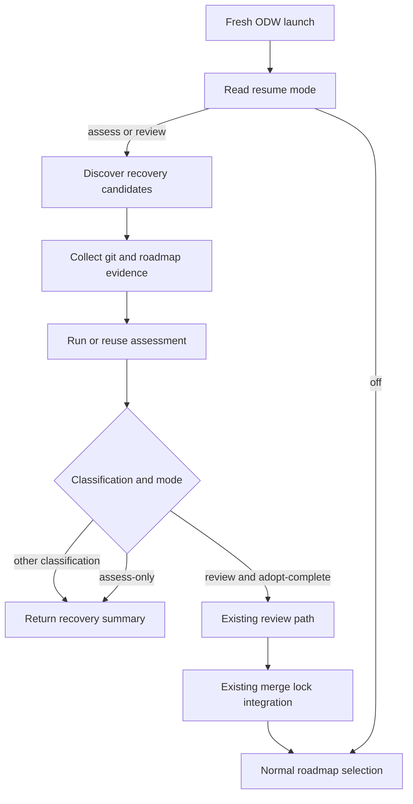

# df12-build failure resume design

Status: Draft.

Audience: maintainers implementing `workflows/df12-build-odw.js`, operators
supervising ODW workshops, and reviewers checking recovery behaviour.

Companion documents:

- `docs/adr-001-adopt-odw-sidecar-launches.md`
- `docs/adr-002-assess-partial-task-branches.md`
- `docs/architecture.md`
- `docs/security-and-permissions.md`
- `docs/users-guide.md`
- `docs/roadmap.md`

## Problem

ADR 002 added report-only assessment for task branches that fail or halt after a
worktree exists. That helps an operator decide what to do with a surviving
branch, but it does not make a fresh run discover that branch or re-enter the
workflow at a safe stage.

The next recovery milestone is full resume from durable Git state. A fresh ODW
launch should find surviving task branches, assess them if needed, and, when an
operator explicitly allows it, move clean `adopt-complete` branches through the
ordinary review and integration path. It must not resume old adapter
transcripts, hidden sessions, or the host agent's context.

## Research summary

Firecrawl research found two relevant external constraints.

| Source | Finding | Design effect |
| - | - | - |
| ODW README | ODW runs are detached background workers with `status`, `logs --follow`, `result`, `pause`, `resume`, and `stop` commands, and run output is backed by a run directory. | `df12-build` can use ODW run results for operator visibility, but recovery must still use target-project Git state because task work lives in real worktrees. |
| ODW README | ODW uses JSON Schema as the reliable hand-off between agent calls. | Recovery decisions that JavaScript consumes must remain schema-bound. |
| ODW README | Upstream ODW lists resume, journalling, and replay determinism as future roadmap items. | `df12-build` must not wait for upstream checkpointing; this design stays at the workflow layer. |
| Claude Code workflow docs | Claude Code workflow resume works within the same session; a later session starts the workflow fresh. | This design treats same-session resume as insufficient for system failure and token-exhaustion recovery. |
| Claude Code workflow docs | Workflow scripts coordinate agents; intermediate results live in script variables. | Durable resume cannot depend on script variables surviving process death. |

References are listed at the end of this document.

## Goals

- Discover surviving `roadmap-*` branches and worktrees on a fresh ODW launch.
- Reuse the ADR 002 assessment schema and evidence collector wherever possible.
- Default to assess-only behaviour, with no writes to the target project.
- Allow explicit review-mode resume for clean `adopt-complete` branches.
- Keep `adopt-partial`, `continue-manual`, and `discard` advisory in this
  milestone.
- Keep all merge, push, and roadmap-checkbox changes behind the existing
  integration path and merge lock.

## Non-goals

- No adapter transcript resume.
- No ODW runtime checkpointing, journalling, or replay engine.
- No automatic cherry-picking of `adopt-partial` branches.
- No automatic deletion of branches or worktrees.
- No resume support for the Claude Code-targeted `workflows/df12-build.js`.

## Design intent

Resume means "discover durable branch state and re-enter the workflow at a
safe stage", not "continue the old conversation". The workflow should behave as
though a cautious operator found the branch, read the assessment, and chose the
least powerful recovery action that preserves correctness.

## Terminology

| Term | Meaning |
| - | - |
| Recovery candidate | A surviving task branch or worktree whose name maps to a roadmap id. |
| Assessment | The ADR 002 schema-bound classification and evidence summary. |
| Resume mode | The maximum action the workflow may take for recovery candidates. |
| Assess-only | Discovery plus assessment, returning JSON only. |
| Review resume | Re-entering the existing review and integration path for an `adopt-complete` branch. |

## Architecture

The current workflow already owns task selection, worktree creation,
implementation, assessment, review, and integration. Full resume adds a
startup recovery phase before normal task selection. That phase constructs
synthetic task results from Git evidence, then either reports them or routes
eligible branches into existing review and integration code.

Figure 1 shows the intended control flow.



The diagram has one important constraint: only the `Review -> Integrate` branch
can mutate the target project, and it is reachable only when the operator opts
into review-mode resume.

## Runtime configuration

Add these ODW `args` fields:

| Argument | Default | Meaning |
| - | - | - |
| `resumePartialBranches` | `false` | Enable fresh-run recovery discovery. |
| `resumeMode` | `"assess"` | One of `"assess"` or `"review"`. `"assess"` reports only. `"review"` may route clean `adopt-complete` branches into review and integration. |
| `resumeTaskId` | unset | Limit recovery discovery to one roadmap id. This is separate from `taskId`, which selects normal roadmap work. |
| `resumeMaxCandidates` | `4` | Bound startup recovery fan-in so a messy repository does not consume the whole run. |

`resumeMode` is intentionally not called `autoResume`. The name should force an
operator to choose the maximum action allowed by the run.

## Recovery candidate discovery

Discovery reads Git state from the target repository. It should not inspect old
ODW run directories for correctness decisions.

The discovery algorithm:

1. Fetch `origin/<base>` if the current workflow already does so for selection.
2. Read the canonical roadmap from `origin/<base>:<roadmap>`.
3. List local worktrees and local branches matching the workflow's task-branch
   naming convention, currently `roadmap-<id-with-dashes>`.
4. Map each branch back to a dotted roadmap id.
5. Drop candidates whose roadmap id is already complete on `origin/<base>`.
6. Drop candidates with no branch or no readable commit.
7. Prefer a live worktree when one exists; otherwise recreate or attach a
   temporary read-only worktree in a later implementation task.
8. Sort by roadmap line number, then branch name.
9. Apply `resumeTaskId` and `resumeMaxCandidates`.

Discovery returns structured candidates, not prose:

```javascript
{
  taskId: "1.2.3",
  taskTitle: "Implement the parser state machine",
  branchName: "roadmap-1-2-3",
  worktreePath: "/path/to/project.worktrees/roadmap-1-2-3",
  baseCommit: "abc123",
  currentCommit: "def456",
  roadmapComplete: false
}
```

## Assessment reuse

The recovery phase should call the existing `collectAssessmentEvidence()` and
assessment agent path unless a candidate already carries an assessment in the
current run result. The workflow should not invent a second classification
contract.

Assessment remains skipped for auth failures. A recovered branch is not an auth
failure merely because the previous run halted under token exhaustion; it is an
ordinary recovery candidate unless its durable evidence says otherwise.

## Resume decisions

The workflow applies this decision table after assessment:

| Classification | `resumeMode="assess"` | `resumeMode="review"` |
| - | - | - |
| `adopt-complete` | Report candidate. | Review and integrate only if the branch is clean, committed, task-scoped, and has validation evidence. |
| `adopt-partial` | Report candidate. | Report candidate; do not merge automatically. |
| `continue-manual` | Report candidate. | Report candidate; do not merge automatically. |
| `discard` | Report candidate. | Report candidate; do not delete automatically. |

`resumeMode="review"` must still fail closed. If any required evidence is
missing, the candidate remains `continue-manual` in the returned recovery
summary even when the assessment said `adopt-complete`.

## Review-mode resume path

Review-mode resume should reuse the ordinary review and integration path. It
must not re-run implementation for the recovered task. The workflow should
construct a synthetic implementation result from durable evidence:

```javascript
{
  ok: true,
  gatesGreen: true,
  execplanPath: "<path from assessment>",
  workItemsCompleted: 0,
  workItemsTotal: 0,
  commits: ["<recent branch commit subjects>"],
  coderabbitRuns: 0,
  openIssues: ["recovered branch requires fresh review"],
  summary: "Recovered adopt-complete branch from durable git state."
}
```

The synthetic result is only a bridge into review. It is not proof that the
branch is shippable. The existing code review, expert review, CodeRabbit, gate,
and integration requirements remain decisive.

## Returned result shape

Add a top-level `recovery` object to the workflow result:

```javascript
{
  enabled: true,
  mode: "assess",
  candidates: 2,
  assessed: 2,
  resumed: 0,
  skipped: [
    {
      id: "1.2.4",
      branchName: "roadmap-1-2-4",
      reason: "dirty worktree"
    }
  ],
  results: [
    {
      id: "1.2.3",
      branchName: "roadmap-1-2-3",
      classification: "adopt-complete",
      action: "reported"
    }
  ]
}
```

Per-task `results[]` entries should remain the primary place for review and
integration outcomes. The recovery summary is an index for operators and
supervision tools.

## Failure modes

| Failure | Behaviour |
| - | - |
| Candidate branch cannot be mapped to a roadmap id | Skip and report `unmapped-branch`. |
| Roadmap id is complete on `origin/<base>` | Skip and report `already-complete`. |
| Candidate has dirty files | Assess, but do not review-resume automatically. |
| Candidate lacks validation evidence | Assess, but do not review-resume automatically. |
| Assessment agent fails | Return `assessmentError` and keep normal roadmap selection available. |
| Review or integration fails after resume | Halt through the existing failure path with the recovered branch left intact. |
| Auth preflight fails | Stop as `fatal-auth`; do not assess or resume branches. |

## Security and permissions

Assess-only mode needs read access to branches, worktrees, roadmap text,
ExecPlans, and validation evidence. Review-mode resume needs the same write and
push permissions as ordinary task integration because it can merge and push via
the existing integration path.

All assessment and recovery evidence can be sent to the selected assessment and
review adapters. The security guide's prompt-injection warning applies to every
piece of recovered branch content.

## Verification

The implementation should add focused tests for:

- candidate discovery from branch and worktree fixtures;
- roadmap id mapping and completed-task skipping;
- `resumeMode` decision-table behaviour;
- review-mode eligibility for clean versus dirty branches;
- top-level `recovery` result shape;
- no mutation in assess-only mode.

The routine repository gate remains `make all`. A live `odw run` smoke test
requires explicit operator approval because it can spawn agents and mutate a
target project.

## Deferred decisions

- Automatic partial adoption for `adopt-partial`.
- Branch or worktree deletion for `discard`.
- Persisting assessment files into the target repository.
- Reading old ODW run directories as advisory context.
- Upstream ODW journalling or replay integration.

## References

- ODW README:
  `https://github.com/xz1220/open-dynamic-workflows/blob/main/README.md`.
- Claude Code dynamic workflows:
  `https://code.claude.com/docs/en/workflows`.
- ADR 002:
  `docs/adr-002-assess-partial-task-branches.md`.
