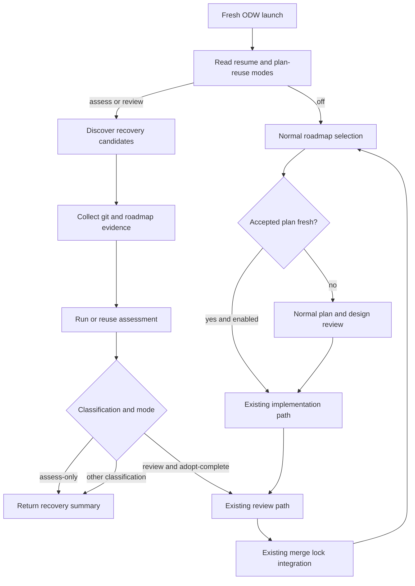

# df12-build failure resume design

Status: Draft.

Audience: maintainers implementing `workflows/df12-build-odw.js`, operators
supervising ODW workshops, and reviewers checking recovery behaviour.

Companion documents:

- `docs/adr-001-adopt-odw-sidecar-launches.md`
- `docs/adr-002-assess-partial-task-branches.md`
- `docs/architecture.md`
- `docs/security-and-permissions.md`
- `docs/users-guide.md`
- `docs/roadmap.md`

## Problem

ADR 002 added report-only assessment for task branches that fail or halt after a
worktree exists. That helps an operator decide what to do with a surviving
branch, but it does not make a fresh run discover that branch or re-enter the
workflow at a safe stage.

The next recovery milestone is full resume from durable Git state. A fresh ODW
launch should find surviving task branches, assess them if needed, and, when an
operator explicitly allows it, move clean `adopt-complete` branches through the
ordinary review and integration path. It must not resume old adapter
transcripts, hidden sessions, or the host agent's context.

A related but distinct failure mode exists when a task has a durable ExecPlan
that already passed design review, but no implementation has landed yet. The
workflow should have a clean way to reuse that accepted plan instead of spending
another planning/design-review loop on the same task. This is plan-state
continuation, not branch-state continuation: the durable artefact is the
accepted ExecPlan plus freshness evidence, not a completed task branch.

## Research summary

Firecrawl research found two relevant external constraints.

| Source | Finding | Design effect |
| - | - | - |
| ODW README | ODW runs are detached background workers with `status`, `logs --follow`, `result`, `pause`, `resume`, and `stop` commands, and run output is backed by a run directory. | `df12-build` can use ODW run results for operator visibility, but recovery must still use target-project Git state because task work lives in real worktrees. |
| ODW README | ODW uses JSON Schema as the reliable hand-off between agent calls. | Recovery decisions that JavaScript consumes must remain schema-bound. |
| ODW README | Upstream ODW lists resume, journalling, and replay determinism as future roadmap items. | `df12-build` must not wait for upstream checkpointing; this design stays at the workflow layer. |
| Claude Code workflow docs | Claude Code workflow resume works within the same session; a later session starts the workflow fresh. | This design treats same-session resume as insufficient for system failure and token-exhaustion recovery. |
| Claude Code workflow docs | Workflow scripts coordinate agents; intermediate results live in script variables. | Durable resume cannot depend on script variables surviving process death. |

References are listed at the end of this document.

## Goals

- Discover surviving `roadmap-*` branches and worktrees on a fresh ODW launch.
- Reuse the ADR 002 assessment schema and evidence collector wherever possible.
- Default to assess-only behaviour, with no writes to the target project.
- Allow explicit review-mode resume for clean `adopt-complete` branches.
- Allow explicit accepted-ExecPlan reuse for open, unbuilt roadmap tasks whose
  plan is durable, approved, and fresh against the current task and design
  inputs.
- Keep `adopt-partial`, `continue-manual`, and `discard` advisory in this
  milestone.
- Keep all merge, push, and roadmap-checkbox changes behind the existing
  integration path and merge lock.

## Non-goals

- No adapter transcript resume.
- No ODW runtime checkpointing, journalling, or replay engine.
- No automatic cherry-picking of `adopt-partial` branches.
- No automatic trust in transient design-review state. Accepted plan reuse
  requires durable plan metadata and freshness checks.
- No automatic deletion of branches or worktrees.
- No resume support for the Claude Code-targeted `workflows/df12-build.js`.

## Design intent

Resume means "discover durable branch state and re-enter the workflow at a
safe stage", not "continue the old conversation". The workflow should behave as
though a cautious operator found the branch, read the assessment, and chose the
least powerful recovery action that preserves correctness.

## Terminology

| Term | Meaning |
| - | - |
| Recovery candidate | A surviving task branch or worktree whose name maps to a roadmap id. |
| Assessment | The ADR 002 schema-bound classification and evidence summary. |
| Resume mode | The maximum action the workflow may take for recovery candidates. |
| Assess-only | Discovery plus assessment, returning JSON only. |
| Review resume | Re-entering the existing review and integration path for an `adopt-complete` branch. |
| Accepted ExecPlan | A committed `docs/execplans/roadmap-<id>.md` whose metadata records the roadmap id, approval state, approving design-review evidence, source roadmap commit, and design-input fingerprint. |
| Plan reuse | Re-entering the existing implementation path for an open roadmap task by adopting a fresh accepted ExecPlan instead of running the planner and design reviewer again. |

## Architecture

The current workflow already owns task selection, worktree creation,
implementation, assessment, review, and integration. Full resume adds a
startup recovery phase before normal task selection. That phase constructs
synthetic task results from Git evidence, then either reports them or routes
eligible branches into existing review and integration code.

Figure 1 shows the intended control flow.



The diagram has one important constraint: only the `Review -> Integrate` branch
can mutate the target project, and it is reachable only when the operator opts
into review-mode resume.

Accepted ExecPlan reuse sits after deterministic roadmap selection, not inside
selection itself. Selection remains a pure choice over the current roadmap. Once
an open, dependency-unblocked task is selected, the workflow may inspect the
matching ExecPlan and either adopt it for implementation or fall back to the
ordinary plan/design loop. This keeps stale or ambiguous plan state from
changing the frontier.

The existing task phases remain responsible for writing into real task
worktrees before any resume path can trust their durable state. Planning,
review, implementation, fix, addendum, and integration agents must run with a
writable root that includes the assigned `roadmap-*` worktree. If an adapter is
launched with the control checkout as its only writable root while the task
worktree is a sibling directory, the workflow can receive an `execplanPath`
that was never created on disk. Recovery must treat that as a launch or sandbox
fault, not as a reviewable task plan.

## Runtime configuration

Add these ODW `args` fields:

| Argument | Default | Meaning |
| - | - | - |
| `resumePartialBranches` | `false` | Enable fresh-run recovery discovery. |
| `resumeMode` | `"assess"` | One of `"assess"`, `"review"`, or `"continue"`. `"assess"` reports only. `"review"` may route clean `adopt-complete` branches into review and integration. `"continue"` dispatches deterministically on the committed ExecPlan `Status` and re-enters the ordinary pipeline at the plan, implement, or review stage. |
| `resumeTaskId` | unset | Limit recovery discovery to one roadmap id. This is separate from `taskId`, which selects normal roadmap work. |
| `resumeMaxCandidates` | `4` | Bound startup recovery fan-in so a messy repository does not consume the whole run. |
| `reuseAcceptedExecPlans` | `false` | Enable accepted-plan adoption after normal roadmap selection. When disabled, every normal task still enters the existing plan/design loop. |
| `acceptedPlanMode` | `"verify"` | One of `"verify"` or `"build"`. `"verify"` reports whether a matching plan is adoptable. `"build"` may enter implementation when the plan is fresh and accepted. |

`resumeMode` is intentionally not called `autoResume`. The name should force an
operator to choose the maximum action allowed by the run.

## Recovery candidate discovery

Discovery reads Git state from the target repository. It should not inspect old
ODW run directories for correctness decisions.

The discovery algorithm:

1. Fetch `origin/<base>` if the current workflow already does so for selection.
2. Read the canonical roadmap from `origin/<base>:<roadmap>`.
3. List local worktrees and local branches matching the workflow's task-branch
   naming convention, currently `roadmap-<id-with-dashes>`.
4. Map each branch back to a dotted roadmap id.
5. Drop candidates whose roadmap id is already complete on `origin/<base>`.
6. Drop candidates with no branch or no readable commit.
7. Prefer a live worktree when one exists; otherwise recreate or attach a
   temporary read-only worktree in a later implementation task.
8. Sort by roadmap line number, then branch name.
9. Apply `resumeTaskId` and `resumeMaxCandidates`.

Discovery returns structured candidates, not prose:

```javascript
{
  taskId: "1.2.3",
  taskTitle: "Implement the parser state machine",
  branchName: "roadmap-1-2-3",
  worktreePath: "/path/to/project.worktrees/roadmap-1-2-3",
  baseCommit: "abc123",
  currentCommit: "def456",
  roadmapComplete: false
}
```

## Assessment reuse

The recovery phase should call the existing `collectAssessmentEvidence()` and
assessment agent path unless a candidate already carries an assessment in the
current run result. The workflow should not invent a second classification
contract.

Assessment remains skipped for auth failures. A recovered branch is not an auth
failure merely because the previous run halted under token exhaustion; it is an
ordinary recovery candidate unless its durable evidence says otherwise.

## Accepted ExecPlan reuse

Accepted plan reuse addresses an open roadmap task that is not yet built, but
whose plan has already been reviewed and accepted in durable project state. It
is not a substitute for branch recovery, and it must not treat an old transcript
or dashboard line as approval.

The workflow should look for a candidate plan only after the deterministic
selector has picked an ordinary open task. The expected path is
`docs/execplans/roadmap-<id-with-dashes>.md`, with a later implementation free
to support an explicit path in metadata if needed. A plan is adoptable only when
all of these checks pass:

1. The roadmap task is still open, dependency-unblocked, and has the same id
   and materially the same task text the plan records.
2. The plan is committed in durable Git state, not merely present as uncommitted
   work in an abandoned worktree.
3. The plan status is approved, and its acceptance metadata records the design
   review that accepted it.
4. The plan records the source roadmap commit and a fingerprint of the design
   inputs used during approval.
5. The current roadmap task text and configured design documents have not
   changed since the recorded approval, or the workflow can prove the changes
   are irrelevant through an explicit freshness review.
6. The plan names validation commands that remain path-safe and compatible with
   the current repository gates.

If any check fails, the workflow must ignore the plan for automation and run the
normal plan/design loop. It may still report the stale or incomplete plan in the
result so the operator can inspect it.

When `acceptedPlanMode="build"` and the checks pass, the workflow constructs a
normal plan object from the ExecPlan metadata and enters the existing
implementation path. Implementation, CodeRabbit, expert review, integration,
roadmap marking, and audit remain unchanged. The accepted plan only skips the
planner and design reviewer; it does not weaken implementation or review gates.

The durable acceptance marker should be small and machine-readable. A later
implementation task should settle the exact syntax, but the minimum information
is:

- roadmap task id and title;
- `Status: APPROVED`;
- approving design-review run, round, and timestamp;
- source `origin/<base>` commit for `docs/roadmap.md`;
- design-input fingerprint for `designDocs`;
- validation commands the implementer must run.

## Resume decisions

The workflow applies this decision table after assessment:

| Classification | `resumeMode="assess"` | `resumeMode="review"` |
| - | - | - |
| `adopt-complete` | Report candidate. | Review and integrate only if the branch is clean, committed, task-scoped, and has validation evidence. |
| `adopt-partial` | Report candidate. | Report candidate; do not merge automatically. |
| `continue-manual` | Report candidate. | Report candidate; do not merge automatically. |
| `discard` | Report candidate. | Report candidate; do not delete automatically. |

`resumeMode="review"` must still fail closed. If any required evidence is
missing, the candidate remains `continue-manual` in the returned recovery
summary even when the assessment said `adopt-complete`.

## Review-mode resume path

Review-mode resume should reuse the ordinary review and integration path. It
must not re-run implementation for the recovered task. The workflow should
construct a synthetic implementation result from durable evidence:

```javascript
{
  ok: true,
  gatesGreen: true,
  execplanPath: "<path from assessment>",
  workItemsCompleted: 0,
  workItemsTotal: 0,
  commits: ["<recent branch commit subjects>"],
  coderabbitRuns: 0,
  openIssues: ["recovered branch requires fresh review"],
  summary: "Recovered adopt-complete branch from durable git state."
}
```

The synthetic result is only a bridge into review. It is not proof that the
branch is shippable. The existing code review, expert review, CodeRabbit, gate,
and integration requirements remain decisive.

## Continue-mode resume path

`resumeMode="continue"` removes the judgement agent from recovery entirely.
The committed ExecPlan is the durable source of truth for where a task stands,
so a fresh run can dispatch a survivor branch from durable state alone:

| Committed ExecPlan `Status` | Continue-mode action |
| - | - |
| file missing, `DRAFT`, or unrecognized | Re-enter the plan/design-review loop; the planner completes or revises the existing draft in place. |
| `APPROVED` or `IN PROGRESS` | Re-enter implementation; the builder verifies ticked work items briefly and continues from the first unticked one. |
| `COMPLETE` | Re-enter dual review and integration via the synthetic implementation bridge. |
| `BLOCKED` | Report for the operator (`plan-blocked` skip reason). |

Hygiene checks still fail closed before any dispatch: addendum branches,
evidence-collection errors, and dirty worktrees are reported, and a `COMPLETE`
plan with no committed work reports `no-committed-work`. Dry runs report the
stage they would have resumed.

Safety comes from the downstream gates a resumed branch still has to pass —
design review, the deterministic commit gates, dual review, and serialized
integration — not from an up-front classification. The worst case of resuming
a half-built branch is the same as a fresh task failing review.

Continue mode depends on an agent-side durability contract enforced by the
prompts:

- the planner commits the ExecPlan when first written and after every
  revision, leaving `Status: DRAFT`;
- the design reviewer flips `Status` to `APPROVED` (and commits) if and only
  if it is satisfied;
- the implementer sets `Status: IN PROGRESS` before the first work item,
  commits the plan with every work-item tick, and sets `Status: COMPLETE` with
  the retrospective when done;
- fix rounds commit their ExecPlan updates with the fix.

An uncommitted plan is lost when a run dies; a stale `Status` resumes the task
at an earlier stage than necessary, which costs effort but never correctness.

## Returned result shape

Add a top-level `recovery` object to the workflow result:

```javascript
{
  enabled: true,
  mode: "assess",
  candidates: 2,
  assessed: 2,
  resumed: 0,
  skipped: [
    {
      id: "1.2.4",
      branchName: "roadmap-1-2-4",
      reason: "dirty worktree"
    }
  ],
  results: [
    {
      id: "1.2.3",
      branchName: "roadmap-1-2-3",
      classification: "adopt-complete",
      action: "reported"
    }
  ],
  unresolved: [
    {
      id: "1.2.3",
      isAddendum: false,
      branchName: "roadmap-1-2-3",
      classification: "adopt-complete",
      action: "reported"
    }
  ]
}
```

Per-task `results[]` entries should remain the primary place for review and
integration outcomes. The recovery summary is an index for operators and
supervision tools.

`unresolved` lists every survivor branch the run reported but did not
integrate (reported classifications, `resume-failed` branches, and discovery
holds such as `missing-worktree`). These ids stay held out of normal selection
while their branches survive, so the frontier remains blocked until an
operator closes, resumes, splits, or hoovers each one. The run's terminal
state makes this explicit rather than ending indistinguishably from a dry
frontier:

- A failed or halted review-mode resume sets `halted` to
  `recovery resume of task <id> <status> at <stage>: <detail>` (the same
  first-failure semantics as the worker pool), with the per-round reviewer
  verdicts and structured fix-round reports in the result's `reviewRounds`.
- A run that would otherwise stop cleanly while `unresolved` is non-empty sets
  `halted` to `needs-operator-recovery: …` naming the surviving ids.

When accepted-plan reuse is enabled, add a top-level `planReuse` object:

```javascript
{
  enabled: true,
  mode: "verify",
  considered: 1,
  adopted: 0,
  results: [
    {
      id: "1.2.3",
      execplanPath: "docs/execplans/roadmap-1-2-3.md",
      action: "reported",
      reason: "design input changed since approval"
    }
  ]
}
```

The `planReuse` summary must be informational in `"verify"` mode. In `"build"`
mode, an adopted plan should also appear in the normal per-task `results[]`
entry so supervisors can see that implementation started from an existing
accepted plan.

## Failure modes

| Failure | Behaviour |
| - | - |
| Candidate branch cannot be mapped to a roadmap id | Skip and report `unmapped-branch`. |
| Roadmap id is complete on `origin/<base>` | Skip and report `already-complete`. |
| Candidate has dirty files | Assess, but do not review-resume automatically. |
| Candidate lacks validation evidence | Assess, but do not review-resume automatically. |
| Assessment agent fails | Return `assessmentError` and keep normal roadmap selection available. |
| Review or integration fails after resume | Halt through the existing failure path with the recovered branch left intact. |
| Accepted plan is missing, draft, stale, or uncommitted | Report the reason when plan reuse is enabled, then fall back to the normal plan/design loop. |
| Accepted plan metadata is prompt-injected or unparsable | Treat the plan as unavailable for automation and run the normal plan/design loop. |
| Accepted plan build fails | Halt through the existing implementation failure path with the task branch left intact. |
| Auth preflight fails | Stop as `fatal-auth`; do not assess or resume branches. |

## Security and permissions

Assess-only mode needs read access to branches, worktrees, roadmap text,
ExecPlans, and validation evidence. Accepted-plan verification needs read access
to the selected ExecPlan, roadmap text, design docs, and Git commit metadata.
Review-mode resume and accepted-plan build mode need the same write and push
permissions as ordinary task integration because they can merge and push via the
existing integration path.

All assessment, recovery, and accepted-plan evidence can be sent to the selected
assessment and review adapters. The security guide's prompt-injection warning
applies to every piece of recovered branch content and every committed ExecPlan
body the workflow asks an agent to read.

## Verification

The implementation should add focused tests for:

- candidate discovery from branch and worktree fixtures;
- roadmap id mapping and completed-task skipping;
- `resumeMode` decision-table behaviour;
- review-mode eligibility for clean versus dirty branches;
- top-level `recovery` result shape;
- accepted-plan metadata parsing and freshness checks;
- `acceptedPlanMode` report-only versus build-mode behaviour;
- fallback from stale or ambiguous accepted plans to the normal plan/design
  loop;
- top-level `planReuse` result shape;
- no mutation in assess-only mode.

The routine repository gate remains `make all`. A live `odw run` smoke test
requires explicit operator approval because it can spawn agents and mutate a
target project.

## Deferred decisions

- Automatic partial adoption for `adopt-partial`.
- Branch or worktree deletion for `discard`.
- Persisting assessment files into the target repository.
- Reading old ODW run directories as advisory context.
- Supporting non-canonical ExecPlan paths beyond
  `docs/execplans/roadmap-<id>.md`.
- Upstream ODW journalling or replay integration.

## References

- ODW README:
  `https://github.com/xz1220/open-dynamic-workflows/blob/main/README.md`.
- Claude Code dynamic workflows:
  `https://code.claude.com/docs/en/workflows`.
- ADR 002:
  `docs/adr-002-assess-partial-task-branches.md`.
