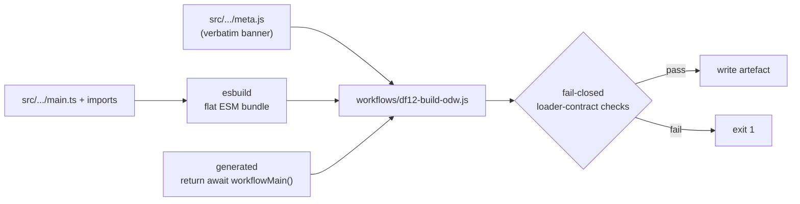

# Compiling the ODW workflow: mechanism and compile-time testing

This monograph explains how the shipped ODW workflow artefact
`workflows/df12-build-odw.js` is produced from the TypeScript module tree under
`src/workflows/df12-build-odw/`, why the compilation is shaped the way it is,
and how the behaviour that only exists at compile time is tested. It is written
for contributors who change the module tree, the build script, or the gates
that police them.

The companion operational rules live in the developers' guide (see
"Submodule architecture and composition"); this document is the reference for
*why* those rules exist.

## Why there is a compiler at all

The Open Dynamic Workflows (ODW) runtime does not load an ordinary JavaScript
module. Its loader demands a single file whose only `export` is a literal
`export const meta = { … }`, and it executes the rest of the file as the body
of an async function with the workflow primitives (`agent`, `parallel`,
`pipeline`, `phase`, `log`, `args`, `budget`, `workflow`, and `validate`)
injected as parameters. Two consequences fall out of that contract:

- Top-level `await` and top-level `return` are legal, because the body is
  wrapped in an async function before it runs.
- No other `import` or `export` statement may appear anywhere outside the
  `meta` literal, because the body is not a module.

A workflow that begins as one 3,000-line file is unmaintainable and untestable
in isolation. But no bundler emits the exact single-file, no-import/export,
flat-top-level shape the loader wants. So the repository keeps the source as a
normal, typed, per-subsystem module tree and *compiles* it into the artefact
the loader accepts. `scripts/build-workflow.mjs` is that compiler, and it is
deliberately small: it frames three pieces and then fails closed on every
loader-contract hazard it can detect.

## The three-piece frame

`make workflow-build` runs `scripts/build-workflow.mjs`, which assembles the
artefact from three parts in order:



*Figure 1 — the build pipeline.* The `meta.js` banner, the esbuild bundle of
`main.ts`, and the generated footer are concatenated, run through the
fail-closed checks, and only written if every check passes.

1. **Banner** — `src/workflows/df12-build-odw/meta.js`, concatenated
   **verbatim**. The build never parses or transforms it, so the `export const
   meta` literal survives byte-for-byte, exactly as the loader will extract and
   evaluate it. This is why `meta.js` stays plain JavaScript forever: it is the
   one region that must reach the artefact unmodified.
2. **Bundle** — the esbuild output for `main.ts` and everything it imports,
   configured (`format: 'esm'`, `platform: 'neutral'`, `treeShaking: false`) so
   that a no-export entry produces flat top-level code with no `import`/`export`
   statements, free identifiers (`agent`, `log`, `args`, …) left untouched as
   the injected primitives, and every top-level name preserved.
3. **Footer** — a generated `return await workflowMain()` that hands control to
   the entry function once every helper and the control loop are in scope.

The result is the flat, single-file, loader-shaped artefact, prefixed with a
`GENERATED FILE` header so no one edits it by hand.

### Why flat top-level, not an IIFE

A tidier bundle would wrap everything in an immediately-invoked function
expression. This build deliberately does not, for two reasons. First, the ODW
loader already supplies the function wrapper; a second wrapper would nest the
`return` and change the injected-primitive scoping. Second, the helper-surface
tests slice the *source* and compile named helpers in isolation, and the build's
own rename-survival check (below) relies on every exported helper existing as a
plain top-level declaration under its own name. A flat namespace keeps the
artefact readable and keeps those checks meaningful.

### Why tree-shaking is off

`treeShaking: false` guarantees that a helper which is currently unreferenced
cannot silently vanish from the artefact. A workflow helper that looks dead may
be reached only through a prompt-selected path or a future wiring change;
dropping it at build time would be an invisible behavioural change. Keeping
every declaration also lets the source-invariant tests reason about the whole
tree.

## Composition: the factory-binding pattern

`main.ts` is the entry module. It unpacks the run configuration once, binds the
subsystem factories, and runs the worker-pool control loop. Every subsystem
module exports a `makeX(deps)` factory (for example `makeConfig`,
`makeTaskPipeline`, `makeHostReview`, `makeRecoveryDiscovery`,
`makePrompts`, `makeAssessment`, `makeRemediation`), and `main.ts` binds each
one exactly once against the resolved configuration and shared locks:

```ts
const { runTask } = makeTaskPipeline({ CS_CHECK, runCodeSceneCheck, /* … */ })
```

This pattern is not decoration; it is what makes the decomposition compatible
with the single-file compile:

- **It avoids top-level name collisions.** esbuild renames a colliding top-level
  symbol (`foo` → `foo2`) when two modules export the same name. In a flat
  namespace that would silently rewire the artefact — and it breaks the
  rename-survival check. Binding dependencies through a factory closure keeps
  each module's public surface small and its internal names local, so the
  top-level namespace stays collision-free.
- **It preserves call-site shapes.** The source-invariant tests match structural
  tokens (function names, option keys, status literals) in the source. Binding
  the dependencies once and keeping the call sites stable means those invariants
  survive refactors that move a helper between modules.
- **It keeps the wiring explicit.** Configuration flows in one direction, from
  `main.ts` into the factories, so there is a single place to see how a run is
  parameterised.

## The fail-closed build checks

The compiler treats the loader contract as something to *prove*, not assume.
Each check guards a specific way the artefact could load-fail or behave wrongly
at runtime, where debugging is expensive:

- **Exactly one `export const meta`** in the banner. More than one, or none,
  fails the build.
- **No module-closure wrappers** (`__esm(`, `__commonJS(`, `__toESM(`,
  `__require(`). esbuild emits these when it has to defer a module (import
  cycles, CommonJS interop). They would break the flat-namespace assumption and
  can smuggle `import`/`export` semantics past the loader, so their presence is
  a hard error. In practice this means: **keep the `src` modules acyclic ESM.**
- **No surviving `import`/`export` statement** anywhere in the bundle.
- **No dynamic `import(` and no `import.meta`**, both of which the ODW loader
  rejects.
- **Rename survival.** For every `export function|class|const|let|var NAME` in
  every module, the bundle must still contain a top-level declaration of that
  same `NAME`. This catches the esbuild collision-rename described above, and it
  also catches a subtler case: **a module authored but never imported.** If
  nothing in `main.ts`'s import graph reaches a new module, its exported names
  never enter the bundle, and the build fails closed rather than shipping an
  artefact that silently omits the new code.
- **Exactly one `async function workflowMain()`.** The generated footer calls
  it; two or zero would be ambiguous or broken.
- **Loader-wrap parse.** Finally the build mirrors the loader: it strips the
  `meta` export and requires the whole artefact to parse as the body of an async
  function (`new Function('return (async function … () { … })')`). If the
  framed artefact would not parse under the loader's wrap, the build fails
  before writing it.

Because these checks run on every `make workflow-build`, the build script is
itself a compile-time regression test for the loader contract — see the testing
section below.

## The TypeScript restriction

The `src` tree is TypeScript, but restricted to **erasable syntax only** so that
type stripping yields valid workflow JavaScript with no runtime shape of its
own. `tsconfig.json` sets:

- `erasableSyntaxOnly` — rejects constructs that emit runtime code (enums,
  parameter properties, namespaces with runtime members). Type annotations,
  `interface`, `type`, and `as` casts are erasable and allowed.
- `verbatimModuleSyntax` and `isolatedModules` — keep import/export elision
  predictable and each file independently transpilable, which is what esbuild
  needs.
- `allowImportingTsExtensions` — because esbuild does not resolve a `.js`
  specifier to a `.ts` file, **relative imports in the tree must carry the
  explicit `.ts` extension** (`import { makeConfig } from './config.ts'`).

The injected ODW primitives are declared ambiently in `odw-globals.d.ts`, never
imported, so the source type-checks while the bundle leaves them as free
identifiers for the loader to inject.

Two further dialect rules are enforced by ODW's dual-compatibility scan and must
be respected in the source: `Date.now()`, `Math.random()`, and arg-less
`new Date()` are banned (they break deterministic run resumption under Claude
Code's reader). Hash a seed instead of calling `Math.random()`, and shell out to
`date` for timestamps.

## Peculiarities and limitations (the short list)

- `meta.js` is plain JavaScript, forever, and must contain exactly one literal
  `export const meta`. Do not turn it into TypeScript or compute the metadata.
- A new module only reaches the artefact once `main.ts` imports something from
  it; an unwired module fails the rename-survival check rather than shipping
  silently.
- Two modules must not export the same top-level name; the collision rename
  fails the build. Prefer the `makeX` factory surface and unique helper names.
- No import cycles and no CommonJS in the tree; either makes esbuild emit a
  closure wrapper that fails the build.
- Erasable syntax only; explicit `.ts` import extensions; no `Date.now()` /
  `Math.random()` / arg-less `new Date()`.
- The artefact is generated **and** committed. Edit the source and run
  `make workflow-build`; never hand-edit `workflows/df12-build-odw.js`. The
  `workflow-freshness` gate fails a stale artefact.

## Testing compile-time behaviour

Most of what this build guarantees cannot be observed by *running* the workflow
— running it needs the ODW runtime and spends agent budget, and a compile-time
regression (a banned construct, a lost helper, a stale artefact) would surface
only late, inside a run. So the compile-time contract is enforced statically and
by dedicated meta-tests, layered as follows.

### Layer 1: the type gate

`make typecheck` runs `tsc -p tsconfig.json --noEmit` over the whole tree. This
is the primary enforcement of the erasable-syntax restriction and of ordinary
type safety. A non-erasable construct (an `enum`, say) fails here with
`TS1294`.

### Layer 2: the parse gate

`make lint`/`make typecheck` also run `workflow-parse`, a small Node check that
strips the `meta` export from each committed workflow file and requires the
result to parse as an async function body — the same wrap the loader and the
build use. It is a cheap syntactic smoke test that both shipped workflow files
still load.

### Layer 3: the build's own fail-closed checks

Every `make workflow-build` (and therefore `make workflow-freshness`, which
rebuilds and diffs) re-runs all the fail-closed assertions above: single `meta`
export, no module wrappers, no import/export, no dynamic import/`import.meta`,
rename survival, single `workflowMain`, and the loader-wrap parse. The build
script is, in effect, an executable specification of the loader contract that
runs on every build.

### Layer 4: the compile-time contract test

`tests/modules/compile-time-contract.test.ts` proves the type restriction is
both **configured** and **enforced**, so a future `tsconfig` regression that
drops a flag fails loudly rather than silently letting non-erasable syntax into
the artefact. It:

- reads `tsconfig.json` and asserts `erasableSyntaxOnly`,
  `verbatimModuleSyntax`, and `isolatedModules` are on;
- writes a temporary file containing a non-erasable `enum`, runs `tsc` over it
  with the restriction flags, and asserts it is **rejected** (`TS1294`); and
- writes an erasable, type-only file and asserts it compiles cleanly under the
  same flags.

This is a compile-fail test — the sanctioned way to assert a compile-time
invariant when there is no runtime behaviour to observe. It runs the compiler
from a temporary directory (which has no `tsconfig.json`) so `tsc` accepts the
command-line file instead of erroring on the repository config.

### Layer 5: source-invariant tests read the source, not the artefact

The helper-surface and wiring-invariant suites read the **`src` tree**
(via `readWorkflowSource()` / `readModuleSource()` in
`tests/support/workflow-source.mjs`), not the reprinted artefact. esbuild
normalises quotes and strips comments, so an assertion pinned against the
artefact would break on cosmetic reprinting; pinning against the source keeps
those invariants meaningful, and `make workflow-freshness` ties the artefact
back to that source. When an invariant's tokens all live in one module, scope
the read to that module with `readModuleSource(name)` so an ordered match cannot
span module boundaries in the concatenated tree.

## Adding a module (worked checklist)

1. Create `src/workflows/df12-build-odw/<subsystem>.ts`, exporting a
   `make<Subsystem>(deps)` factory and any pure helpers, with unique top-level
   names.
2. Import from it in `main.ts` (using the explicit `.ts` extension) and bind the
   factory once against the run configuration.
3. Keep the module acyclic ESM and erasable-syntax-only; declare no ODW
   primitive (they are ambient).
4. Run `make workflow-build` — the fail-closed checks confirm the module's names
   survive into the artefact and the loader contract holds.
5. Add `tests/modules/<subsystem>.test.ts` for the pure helpers and any
   source-invariants; run `make test`.
6. Run `make all` (which includes `workflow-freshness` and `verify-modules`) and
   commit the source **and** the regenerated artefact together.
