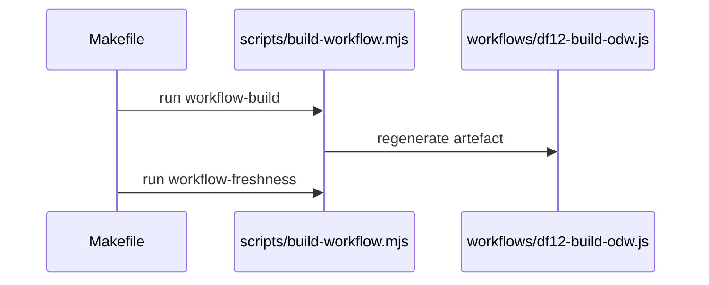
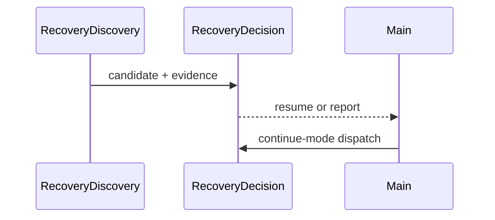
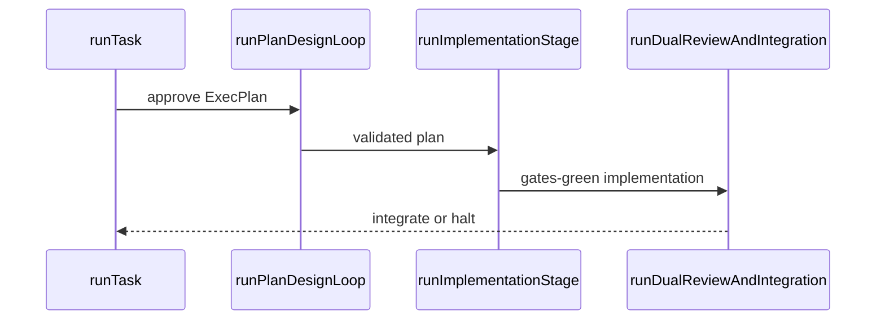

# df12-build user guide

`df12-build` drives a df12-house GIST roadmap forward with a parallel [Open
Dynamic Workflows (ODW)](https://github.com/xz1220/open-dynamic-workflows)
workflow. It plans, reviews, implements, gates, integrates, audits, and files
remediation work through isolated worker branches. Use it only for projects that
already have a roadmap, design documentation, `AGENTS.md`, repository gates, and
the df12 skill/toolchain installed.

## Workflow at a glance

Three sequence diagrams sketch the moving parts an operator works around: how
the shipped workflow artefact is built, how a fresh launch recovers surviving
branches, and how a single task moves from plan to integration. Each diagram is
followed by a text description that conveys the same sequence.

Figure 1 shows how the single-file workflow artefact is produced and kept
honest.



*Figure 1 — the build pipeline.* `make workflow-build` runs
`scripts/build-workflow.mjs`, which regenerates the committed single-file
artefact `workflows/df12-build-odw.js` from the module tree. `make
workflow-freshness` then re-runs the build and fails if the committed artefact
differs, so a stale artefact can never land.

Figure 2 shows fresh-run recovery of surviving task branches.



*Figure 2 — fresh-run recovery.* Recovery discovery hands each surviving
branch's candidate record and host-collected git evidence to the recovery
decision. The decision returns either an eligible branch to resume or a
report-only result to the main loop; in continue mode, the main loop asks the
decision which stage to dispatch next from the committed ExecPlan state.

Figure 3 shows how a single task moves from plan to integration.



*Figure 3 — the per-task pipeline.* `runTask` drives the plan and design-review
loop until the ExecPlan is approved, hands the validated plan to the
implementation stage, and that stage passes gates-green work to dual review and
integration. The review-and-integration stage either integrates the branch
through the merge lock or halts it for the operator.

## Launch model

Current ODW launches use a `.workshop` sidecar outside the target project's Git
worktree. Do not launch a long-running workshop from `.claude/`, `/tmp`, the
project source tree, or a workflow-owned `...worktrees/roadmap-*` worktree.
Those locations can be cleaned, switched, or removed while the workshop is still
recoverable.

The sidecar is durable run-control state. The target repository remains the
source of truth for product changes, and `origin/<base>` remains the recovery
point for fresh restarts.

```bash
PROJECT=/data/leynos/Projects/example-project
RUN_ID="$(date -u +%Y%m%dT%H%M%SZ)-$$"
SIDECAR="${PROJECT}.workshop/df12-build-${RUN_ID}"
mkdir -p "$SIDECAR"
```

## Sidecar artefacts

Keep these files together in the sidecar:

- `df12-build-odw.js`: the copied workflow script that the live run executes.
- `odw.config.json`: the ODW runtime, adapter, model, workspace, and permission
  configuration for the run.
- `args.json`: the project-specific workflow arguments.
- `operator-notes.md`: the run id, launch command, local sidecar patches,
  validation notes, health checks, failures, and operator decisions.

Set `concurrency` to `16` in `odw.config.json` for normal Codex and Claude Code
workshops. That leaves room for an eight-task worker pool, four planning-stage
agents, four build-stage agents, and review, triage, audit, or assessment
slack. Keep `maxAgents` high (such as the ODW default of `1000`) because it is
the per-run dispatch guard rather than the live process-pool size.

Set the adapter `timeout` with the CodeRabbit flow in mind. With the default
host-run CodeRabbit review (`coderabbitHostReview`, see the configuration
list), agents never wait on CodeRabbit — the host absorbs rate-limit backoff
in its own wall-clock — so the adapter timeout only needs to cover honest
stage work; 4500–5400 seconds (75–90 minutes) is generous, and a longer
silent stream is a hung connection, not progress. Only when
`coderabbitHostReview=false` do implementation agents wait through 45–90
minute CodeRabbit backoffs with `vsleep` themselves, and then the timeout
must be at least `21600` seconds to avoid killing a healthy task mid-backoff.

Make sure every adapter named by `args.json` exists in `odw.config.json` or in
ODW's built-in adapter set. The checked-in ODW workflow now defaults planning
and review judgement to the `claude` adapter, so a Codex-only sidecar config
must either add a `claude` adapter or explicitly route those stages back to
Codex.

Minimal sidecar `odw.config.json` shape for the Claude/Codex split:

```json
{
  "defaultAdapter": "codex-medium",
  "concurrency": 16,
  "maxAgents": 1000,
  "workspaceMode": "inplace",
  "timeout": 5400,
  "schemaRetries": 2,
  "runsRoot": "/abs/path/to/example-project.workshop/df12-build-RUN/runs",
  "workflowsRoot": "~/.odw/workflows",
  "claudeJobsScope": "project",
  "adapters": {
    "claude": {
      "label": "Claude Code",
      "command": [
        "claude",
        "--print",
        "--permission-mode",
        "acceptEdits",
        "--no-session-persistence"
      ],
      "stdin": "{prompt}",
      "flags": {
        "model": ["--model"]
      }
    },
    "codex-medium": {
      "label": "Codex GPT 5.5 medium",
      "timeout": 3600,
      "command": [
        "codex",
        "--ask-for-approval",
        "never",
        "exec",
        "--skip-git-repo-check",
        "--sandbox",
        "danger-full-access",
        "-c",
        "model_reasoning_effort=\"medium\"",
        "--cd",
        "{workspace}",
        "-"
      ],
      "stdin": "{prompt}",
      "flags": {
        "model": ["--model"]
      }
    },
    "codex-high": {
      "label": "Codex GPT 5.5 high",
      "command": [
        "codex",
        "--ask-for-approval",
        "never",
        "exec",
        "--skip-git-repo-check",
        "--sandbox",
        "danger-full-access",
        "-c",
        "model_reasoning_effort=\"high\"",
        "--cd",
        "{workspace}",
        "-"
      ],
      "stdin": "{prompt}",
      "flags": {
        "model": ["--model"]
      }
    }
  }
}
```

### Inspectable logs in the sidecar

Point both log sinks at the sidecar so a run's agent transcripts and CodeRabbit
findings are durably inspectable next to the run, without touching workflow
behaviour — both are out-of-band sinks outside the project Git worktree, so
they never enter a diff, trip `workflow-freshness`, or affect a gate:

- **Agent logs** — set `runsRoot` (in `odw.config.json`) to an absolute path
  inside the run's sidecar, e.g. `"$SIDECAR/runs"`. ODW writes each run's
  durable artefacts there: `events.jsonl` (an ordered stream with
  `agent_started`/`agent_finished` per `agent()` call, tagged by adapter,
  label, and phase), `result.json` (the final return, including every
  `reviewRounds`, `assessments`, host-gate result, and CodeRabbit summary), and
  `error.json`. This is entirely ODW's domain — no workflow involvement.
  Regenerate the value per run, or use a shared `~/.odw/runs` for a single
  pool; the sidecar keeps each run's logs beside its config and notes.
- **CodeRabbit findings** — set `coderabbitFindingsFile` (in `args.json`) to a
  sidecar JSONL path, e.g. `"$SIDECAR/coderabbit-findings.jsonl"`. Every parsed
  finding (timestamp, task label, severity, file, comment, codegen
  instructions, suggestion count) is appended best-effort: a bad path or full
  disk degrades logging with a warning and never fails a task.

Patch the sidecar copy only to recover or tune a live workshop. Record the patch
in `operator-notes.md`, validate it there, then promote the proven change back
to the `df12-build` repository through a normal branch.

## Starting a run

Copy the checked-in ODW workflow into the sidecar, then launch it from the
sidecar while using the target project as `--source`.

```bash
cp /path/to/df12-build/workflows/df12-build-odw.js \
  "$SIDECAR/df12-build-odw.js"

odw run "$SIDECAR/df12-build-odw.js" \
  --source "$PROJECT" \
  --config "$SIDECAR/odw.config.json" \
  --args @"$SIDECAR/args.json"
```

Use an absolute or fully expanded sidecar path for the workflow script. When
`--source` is present, ODW anchors relative workflow paths under the source
project, not under the shell's current working directory.

Start normal workshop runs in the background. Supervise them with `odw status`,
`odw logs`, `odw result`, and the ODW dashboard. Keep `operator-notes.md` current
enough that another operator can continue after context compaction.

When adopting a newer checked-in workflow into an existing sidecar, audit
`args.json` before relaunching. Older sidecars may still carry Codex-only
`planAdapter`, `reviewAdapter`, or `assessmentAdapter` overrides, and those
overrides deliberately win over the workflow defaults.

## Monitoring runs

`odw status`, `odw logs`, and the dashboard remain the primary supervision
surface. Operator scripts in `scripts/` add workshop-oriented views over ODW
run directories, Git branch movement, and sibling worktree filesystem activity.

`scripts/odw-list-runs` tabulates runs from the ODW runs root, showing the
source project, status, last update, run id, and workflow name. It defaults
to running runs; filters widen or narrow the view:

```bash
scripts/odw-list-runs                        # running runs only
scripts/odw-list-runs --all --limit 20       # every status, newest first
scripts/odw-list-runs -s failed -s stopped   # explicit statuses
scripts/odw-list-runs --source my-project    # substring match on source
```

`scripts/odw-watch` tails events for every *running* run whose metadata
records a given source directory, printing recent history and then following
new events, discovering newly started runs as it polls:

```bash
scripts/odw-watch "$PROJECT" -n 20        # last 20 events, then follow
scripts/odw-watch "$PROJECT" --poll 2.0   # slower discovery/tail cadence
```

Both ODW scripts tolerate live writes (a torn `status.json` or event line is
re-read on the next pass) and warn on stderr when run state is genuinely
malformed. Both read `--runs-dir` (defaulting to `~/.odw/runs`), so point them
at a sidecar-local `runsRoot` when a workshop overrides it.

`scripts/git-commit-feed` prints a live commit feed for local branches in a Git
repository. It prints an initial backlog, then follows branch-tip changes:

```bash
scripts/git-commit-feed "$PROJECT"              # latest 10 commits, then follow
scripts/git-commit-feed "$PROJECT" --remotes    # include remote-tracking refs
scripts/git-commit-feed "$PROJECT" -n 0         # follow-only
```

`scripts/blinkentrees` opens a Textual dashboard over sibling Git worktrees,
using Linux inotify to show file activity per worktree. Run it from the parent
directory that contains the worktrees, or pass that directory explicitly:

```bash
scripts/blinkentrees --pattern 'roadmap-*' .
scripts/blinkentrees --any-matching-dir /path/to/worktrees
```

A task's post-merge audit and a settled step's remediation triage each create
their own throwaway inspection worktree, which appears in `blinkentrees`
alongside the `roadmap-*` build worktrees. These inspection worktrees are built
with the same verified sequence the build worktrees use: fetch `origin/<base>`,
create with `git donkey <slug> <base>` (the configured base is passed
explicitly, because git donkey's no-argument default is always `main`), then
`git reset --hard origin/<base>` inside the new worktree and re-verify its base
sha. So audit and triage always inspect the current `origin/<base>` and can
never silently root on a stale local base. If an audit or triage agent reports a
"based on a stale commit" style failure, that sequence is where to look.

## Roadmap format

`df12-build` expects the target roadmap to follow the df12-house GIST shape:
Goals -> Ideas -> Steps -> Tasks. New projects should use this as the baseline
format before launching a workshop. Older project roadmaps may need grooming
first, because the ODW workflow now uses a deterministic selector rather than a
model-based selector.

The roadmap path defaults to `docs/roadmap.md`. Selection reads the canonical
roadmap from `origin/<base>:<roadmap>`, not from a worker branch or a local
working-tree edit. Keep the integration branch current before launching or
relaunching a run.

At minimum, a runnable roadmap task must be a Markdown checkbox line with a
dotted numeric id:

```markdown
- [ ] 1.2.3. Add parser diagnostics.
  - Success: Parser failures include a stable diagnostic code and source span.
```

The selector recognizes checked and unchecked task lines in this form:

```markdown
- [ ] 1.2.3. Task title.
- [x] 1.2.4. Completed task title.
```

Use dependency lines directly under the task body when a task must wait for
other roadmap ids:

```markdown
- [ ] 1.2.5. Wire diagnostics into the CLI.
  - Requires 1.2.3 and 1.2.4.
  - Success: CLI output includes parser diagnostic codes in error reports.
```

Step ranges are also accepted in `Requires` lines:

```markdown
- [ ] 1.6.1. Stabilize the integration surface.
  - Requires steps 1.2 - 1.5.
  - Success: The integration API is documented and covered by tests.
```

The deterministic selector treats a task as unblocked when all of these are
true:

- The task checkbox is unchecked.
- Every id named by its `Requires` lines is complete.
- The task has not already been processed, left manual-merge-ready, marked as a
  dry run, or spawned in the current workflow run.

A task is complete when its own checkbox is checked and every nested addendum
subtask below it is also checked. The selector also treats a prefix id as
complete when every task under that prefix is complete. For example, if every
task under `1.2.*` is complete, then `1.2` can satisfy a later `Requires 1.2`
dependency.

Completed tasks may carry nested unchecked addendum subtasks. These are used for
small follow-up corrections that do not need a full plan and review cycle:

```markdown
- [x] 1.2.8. Implement the parser state machine.
  - Success: The parser accepts valid fixtures and rejects invalid fixtures.
  - [ ] 1.2.8.1. Addendum (from review:high). Cover empty-input recovery.
    Lightweight addendum pass.
```

When an addendum subtask is open under a completed parent, the workflow selects
an addendum pass for the parent task and scopes the implementation to the open
nested ids.

Selection is deliberately simple and reproducible:

- Build all normal and addendum candidates from the canonical roadmap.
- Exclude blocked or already-taken work.
- Apply `taskId` if one was supplied.
- Sort remaining candidates by roadmap line number.
- Select the first candidate.

The workflow parses only the mechanical parts needed for scheduling: checkbox
lines, dotted ids, `Requires` lines, step ranges, and nested addendum subtasks.
The broader GIST discipline is still required for useful planning and triage:
each phase should carry an `Idea:`, each step should state the hypothesis it
answers, and each task should include a clear `Success:` criterion.

Treat this section as the baseline contract for future roadmap tooling. A
roadmap editor or linter should preserve these parseable forms, verify that
`Requires` references resolve, and flag malformed ids or dependency lines before
a long-running workshop starts.

## Workflow arguments

Set project-specific behaviour in `args.json`. The workflow also has matching
top-of-file defaults, but the sidecar `args.json` is the normal retuning point
for ODW launches.

Common arguments:

- `base`: integration branch. Defaults to `main`.
- `roadmap`: roadmap path. Defaults to `docs/roadmap.md`.
- `designDocs`: design document and ADR locations cited in planner prompts.
- `researchNote`: optional external-library research pointer, such as a vendored
  source path.
- `projectRoot`: target-project checkout to `chdir` into before the workflow
  creates worktrees. Use this when launching a copied workflow from a sidecar.
- `searchBackend`: canonical code-search backend for prompt guidance. Supported
  values are `grepai` and `memtrace`. Defaults to `grepai`, or to `memtrace`
  when `memtraceRepoId` is set.
- `grepaiWorkspace`: GrepAI workspace name. Defaults to `Projects`.
- `grepaiProject`: canonical main-branch GrepAI project name. Set this when the
  ODW source path or worker worktree path would make `$(get-project)` resolve to
  the wrong project.
- `memtraceRepoId`: canonical Memtrace repository id. Set this, or set
  `searchBackend` to `memtrace`, when GrepAI is unavailable on the host.
- `coderabbitReviewCommand`: CodeRabbit command used in implementation prompts.
  Defaults to `coderabbit review --agent`.
- `maxParallel`: task worker-pool width. Defaults to `8` unless `taskId` is
  set.
- `maxPlanningParallel`: concurrent planning-stage agents. Defaults to `4`.
- `maxBuildParallel`: concurrent build-stage agents. Defaults to `4`.
- `maxTasks`: maximum roadmap tasks for one run.
- `maxDesignRounds`: planning and design-review exchange cap. Defaults to `4`.
- `maxReviewRounds`: implementation review/fix exchange cap. Defaults to `3`.
- `commitGates`: ordered list of deterministic gate commands every task,
  addendum, fix, and remediation agent must run before declaring work green.
  Defaults to `["make all"]`. The run result echoes the effective list so
  operators can audit reported gate greenness against it; agents are told
  never to assume `make all` aggregates the gates a project names in
  `AGENTS.md`.
- `hostCommitGates`: when `true` (the default), the workflow host re-runs the
  `commitGates` commands itself against each branch's committed HEAD before
  review and integration, so a `gatesGreen` claim is verified rather than
  trusted. Set `false` to restore the trust-the-agent flow.
- `commitGateTimeoutSeconds`: per-command timeout for host-run gates.
  Defaults to `3600`; a gate that exceeds it is killed and reported as a
  failure with the timeout named in the evidence.
- `stageAttempts`: total attempts per stage agent when the previous attempt
  died on an infrastructure fault (an ODW adapter timeout or crash, or
  schema-retry exhaustion). Defaults to `2`. Product failures are never
  retried, and the host never re-dispatches a faulted integration stage: a
  crash between the squash push and the agent's return can leave a hidden
  success already landed on `origin/<base>`, which the host cannot detect, so
  repeating the stage risks a double merge. (The integration agent still
  redoes its own squash idempotently on a non-fast-forward push rejection
  within a single turn — see the recovery model.)
- `perWorkItemBuild`: when `true` (the default), the workflow host reads the
  approved ExecPlan's `## Progress` checklist and dispatches one builder turn
  per unticked work item, verifying committed progress after every turn.
  Plans without a Progress checklist fall back to the single-turn build
  automatically; set `false` to force the single-turn build for every task.
- `maxWorkItemRounds`: builder turns per task before the work-item loop fails
  closed. Defaults to `16`.
- `coderabbitHostReview`: when `true` (the default), the workflow host runs
  `coderabbit review --agent` against each task's committed work instead of
  asking agents to babysit CodeRabbit. Rate-limit backoff is absorbed as host
  wall-clock (zero agent tokens), and blocking findings feed the fix rounds.
  Set `false` to restore the legacy agent-run flow.
- `hostGatesBetweenWorkItems`: when `true` (the default), and when both
  `hostCommitGates` and `perWorkItemBuild` are on, the host re-runs the
  commit gates after each committed work item — before the between-item
  CodeRabbit review — so a committed work item whose gates are actually red
  is caught at the item boundary instead of only at the dual-review stage.
  A red gate drives a bounded fix loop; if it cannot be made green the work
  item fails. Set `false` to verify gates only at the dual-review boundary
  (cheaper: one gate run per review round rather than one per work item).
- `csCheck`: when `true` (the default), the host runs a CodeScene code-health
  check on the committed changed files as a deterministic gate AFTER the
  commit gates and BEFORE CodeRabbit (both free checks precede the
  quota-limited CodeRabbit and the token-spending reviewer agents). A
  regression drives a bounded fix round; the build agent clears it by
  refactoring or, only where refactoring would be deleterious, suppresses the
  specific smell with a justified `@codescene(disable:"...")` comment. The
  check skips gracefully when its binary is absent, like `make verify-modules`
  without Dafny. Set `false` to disable it.
- `csCheckCommand`: the command the CodeScene check runs in the worktree.
  Defaults to `cs-check-changed` (an operator-provided wrapper); override it
  with the exact invocation, e.g. `cs check --changed --base main`.
- `coderabbitBetweenWorkItems`: when `true` (the default), and when both
  `coderabbitHostReview` and `perWorkItemBuild` are on, the host runs a
  CodeRabbit review after each committed work item — a deterministic gate
  between build turns, after the host gates — rather than only once after the
  whole implementation stage. Blocking findings drive a bounded fix loop; if
  they cannot be cleared the work item fails, and if CodeRabbit stays
  rate-limited or errors after its retries the task halts for assessment
  instead of continuing unreviewed. Set `false` to review only once at the
  end of the implementation stage.
- `coderabbitAttempts`: total host review attempts when CodeRabbit rate
  limits. Defaults to `3`.
- `coderabbitBackoffMinutes`: `[low, high]` range for the deterministic
  backoff wait between rate-limited attempts. Defaults to `[45, 90]`.
- `coderabbitFindingsFile`: optional absolute path to an append-only JSONL
  file recording every CodeRabbit finding (timestamp, task, severity, file,
  comment). Point it at a sidecar file to accumulate findings across runs and
  tune deterministic lint rules from the recurring classes.
- `writeProbeEffort`: reasoning effort for the once-per-run write-preflight
  probe (write an exact token to an exact path — no reasoning). Defaults to
  `minimal`. The probe keeps the plan/build ADAPTER but never inherits
  `planModel`/`buildModel`.
- `writeProbeModelByAdapter`: optional `{ "<adapter>": "<model>" }` map to run
  the probe on a cheaper model per adapter (adapter name lowercased). Defaults
  to Claude Haiku (`claude-haiku-4-5`) and GPT-5.6 Luna (`gpt-5.6-luna`) for
  the default planning and build adapters respectively.
- `assessmentModel`: model for the report-only partial-branch assessment.
  Defaults to a medium model (`claude-sonnet-5`) rather than inheriting the
  Opus-class review model, because a deterministic fast-classifier already
  handles the clear cases (empty branch, evidence-collection failure) with
  zero tokens and only genuinely ambiguous branches reach the model.
- `assessmentEscalationModel`: the stronger model used for a strong
  adopt-complete candidate (a branch that committed an ExecPlan). Defaults to
  the review model.
- `triageModel`: model for remediation triage. Defaults to a medium model
  (`gpt-5.6-sol`); a deterministic pre-pass collapses exact-duplicate proposals
  before the agent runs.
- `triageEffort`: reasoning effort for remediation triage. Defaults to
  `medium`.
- `triageEscalationModel`: the stronger model used when the deduped proposals
  span more than one audit/review source (potential cross-phase or conflicting
  routing). Defaults to the same `gpt-5.6-sol` model.
- `taskId`: run exactly one roadmap task.
- `dryRun`: when `true`, a fresh task stops before worktree creation — and so
  before planning, review, implementation, integration, or document writes —
  making it a read-only validation path that mutates no git state. (Recovery
  and continue-mode resume keep their own dry-run handling over pre-existing
  worktrees.)
- `autoMerge`: when `false`, leave reviewed task branches for manual
  integration.
- `documentAudit`: when `false`, return audit findings without writing audit
  files.
- `assessPartialBranches`: when `false`, skip the report-only assessment of
  failed or halted task branches. Defaults to enabled.
- `resumePartialBranches`: when `true`, discover surviving `roadmap-*` branches
  on launch and assess them before normal roadmap selection. Defaults to
  `false`; the default workflow behaviour is unchanged unless an operator opts
  in.
- `resumeMode`: the maximum recovery action for discovered branches. `assess`
  (the default) reports only. `review` may additionally route clean, committed,
  task-scoped `adopt-complete` branches with validation evidence into the
  ordinary review and integration path. `continue` dispatches each surviving
  branch deterministically from its committed ExecPlan status, with no
  judgement agent. Any other value fails fast at launch.
- `resumeTaskId`: limit recovery discovery to one roadmap id. This is separate
  from `taskId`, which selects normal roadmap work.
- `resumeMaxCandidates`: bound on recovery candidates per run. Defaults to `4`;
  excess candidates are reported as skipped with reason `candidate-cap`.
- `worktreeWritePreflight`: when `false`, skip the once-per-run probe that
  proves the planning and build adapters can write into sibling task
  worktrees. Defaults to enabled; a failed probe fails the task at stage
  `worktree-write` as an environment fault.
- `buildAdapter` and `buildModel`: adapter and model for worktree creation,
  implementation, integration, and remediation agents.
- `planAdapter` and `planModel`: adapter and model for planning agents.
- `reviewAdapter` and `reviewModel`: adapter and model for design review, code
  review, expert review, and addendum fallback review agents.
- `auditAdapter`, `auditModel`, and `auditEffort`: adapter, model, and effort
  for post-merge audits. Defaults to Claude Code, `claude-sonnet-5`, and
  `medium`.
- `triageAdapter` and `triageModel`: adapter and model for remediation triage
  (routing review and audit proposals onto roadmap lanes). Defaults are
  `codex`, `gpt-5.6-sol`, and medium effort.
- `assessmentAdapter` and `assessmentModel`: adapter and model for partial
  branch assessment. `assessmentAdapter` defaults to the review adapter, while
  `assessmentModel` independently defaults to `claude-sonnet-5`.

Current defaults deliberately split execution and judgement. Build,
implementation, and integration use GPT-5.6 Terra through the medium-effort
Codex adapter; triage uses GPT-5.6 Sol at medium effort. Planning and review
judgement default to Claude Code with
`claude-opus-4-8`. That means the plan stage, design review, code review,
expert review, and addendum fallback review use the `reviewAdapter` or
`planAdapter` Claude routing unless `args.json` overrides them. Post-merge
audit uses Claude Sonnet 5 at medium effort. Set `assessmentAdapter` explicitly
when partial-branch assessment should stay on Codex instead of inheriting the
review adapter.

Example `args.json`:

```json
{
  "base": "main",
  "roadmap": "docs/roadmap.md",
  "projectRoot": "/home/example/Projects/example-project",
  "designDocs": "docs/architecture.md, docs/adr-001-adopt-odw-sidecar-launches.md, docs/users-guide.md, docs/developers-guide.md",
  "searchBackend": "grepai",
  "grepaiWorkspace": "Projects",
  "grepaiProject": "example-project",
  "maxParallel": 8,
  "maxPlanningParallel": 4,
  "maxBuildParallel": 4,
  "maxTasks": 12,
  "coderabbitFindingsFile": "/home/example/Projects/example-project.workshop/df12-build-run/coderabbit-findings.jsonl",
  "buildAdapter": "codex-medium",
  "buildModel": "gpt-5.6-terra",
  "planAdapter": "claude",
  "planModel": "claude-opus-4-8",
  "assessmentAdapter": "codex-high",
  "assessmentModel": "gpt-5.5",
  "triageAdapter": "codex",
  "triageModel": "gpt-5.6-sol",
  "triageEffort": "medium",
  "reviewAdapter": "claude",
  "reviewModel": "claude-opus-4-8",
  "auditAdapter": "claude",
  "auditModel": "claude-sonnet-5",
  "auditEffort": "medium"
}
```

## Host-run CodeRabbit review

By default the workflow host — not the task agents — runs
`coderabbit review --agent --type committed` against each task branch: once
per dual-review round (alongside the code and expert reviewers) and once per
addendum implementation. Because only committed changes are reviewed, the
ExecPlan durability contract doubles as the review contract. The host parses
the CLI's structured findings; `critical` and `major` severities join the
reviewers' blocking items and drive the ordinary fix rounds, while lower
severities are captured without gating integration.

Rate limits are absorbed by the host: a rate-limited review waits a
deterministic 45–90 minutes (`coderabbitBackoffMinutes`) and retries, up to
`coderabbitAttempts` total attempts, costing wall-clock but zero agent
tokens. A rate limit that outlives every attempt — or a CLI fault — defers
the review with a documented `openIssues` entry on the task result instead of
blocking integration; the dual reviewers remain decisive. A CodeRabbit
authentication failure halts the task as `fatal-auth`.

The run result's `coderabbit` object reports the effective configuration and
bounded counters (reviews run, findings by severity, rate-limited runs,
deferred reviews). When `coderabbitFindingsFile` is set, every finding is
also appended as JSONL for cross-run linter tuning.

## Per-work-item builds

By default the build is host-driven, one work item at a time. The planner
records the plan's work items as `- [ ] WI-<n>: <imperative title>` checklist
lines in the ExecPlan's `## Progress` section, and after design approval the
host loops: read the committed checklist, dispatch a builder turn scoped to
exactly the first unticked item, then verify that the turn left the worktree
fully committed and moved the committed checklist forward. A turn that
returns `ok` without committing a tick is bounced once with the defect named
in the next prompt; two consecutive no-progress turns fail the task. The
loop is bounded by `maxWorkItemRounds`, and the committed checklist — not the
agent's say-so — decides when the build is done.

Small turns change the failure economics: each builder turn does one work
item's worth of code, tests, docs, gates, and one atomic commit, so the ODW
build adapter can sit on a tight timeout (roughly 3600 seconds) and a hung
stream costs at most one work item plus a warm `stageAttempts` retry from
the committed ExecPlan — not a whole task. Legacy plans whose Progress
section is prose ticks rather than work items still work: the loop
dispatches "the first unticked item" by its text, and a plan with no
checklist at all falls back to the single-turn build.

The run result's `workItemBuild` object reports the effective configuration.
Work-item turns appear in the events as `implement:<id> wi<n>` labels.

## Host-run commit gates

By default the workflow host also re-runs the deterministic `commitGates`
commands itself — a `gatesGreen` claim from an agent is verified, never
trusted. The gates run at the start of every dual-review round (before any
reviewer agent spends tokens; a red branch goes straight to a fix round
carrying the host's log evidence) and once per addendum implementation
(addenda have no fix rounds, so an unreproducible green claim fails the
addendum outright). Gate runs are serialized across the whole worker pool so
sequential execution benefits from the target project's build caching, and
each command's full output is streamed to a log in a secure per-run
directory (`/tmp/df12-gates-XXXXXX/gate-<task>-<round>-N.out`, created with
mode `0700` and opened exclusively without following symlinks) with a bounded
tail quoted in the failure evidence. A command that
exceeds `commitGateTimeoutSeconds` is killed and reported as a failure. The
run result's `hostGates` object reports the configuration and bounded
counters (gate runs, failures); per-round pass/fail detail appears in each
failed task's `reviewRounds[].hostGates`.

## Recovery model

Do not try to resume a failed workflow from transient cache state. Treat
`origin/<base>` as the source of truth, inspect the result, clean up or repair
the target project as needed, and relaunch from the sidecar. The workflow
re-selects unblocked roadmap work from the current roadmap state.

When a normal task or addendum fails or halts after its worktree exists, the
ODW workflow runs a read-only assessment of the surviving task branch unless
`assessPartialBranches=false`. The per-task result may include an `assessment`
object and the top-level result includes an `assessments` summary array. The
classification is one of:

- `adopt-complete`: the branch appears to satisfy the task and can continue
  through the ordinary review and integration path after gates are verified.
- `adopt-partial`: the branch contains a coherent useful slice, but the roadmap
  task must remain unchecked.
- `continue-manual`: the branch needs operator judgement before any merge.
- `discard`: the branch is stale, unsafe, incoherent, or too incomplete to keep.

Assessment is report-only. It never marks roadmap checkboxes, pushes, merges,
or cherry-picks. Use it to decide whether to preserve, manually finish, park, or
discard the branch before relaunching from `origin/<base>`.

After an `adopt-partial` or `continue-manual` verdict — and also after an
infrastructure fault such as schema-retry exhaustion — the workflow commits any
dirty `docs/execplans/*.md` artefacts onto the task branch so they survive
worktree cleanup. This is artefact salvage. It never merges, pushes, or ticks a
roadmap checkbox; it commits only under a deterministic machine identity
(`df12-build`). Paths outside the `docs/execplans/` tree, symlinks, and paths
that escape the worktree are all rejected before the commit. Salvage does not
run for `adopt-complete` (which proceeds through the ordinary path) or `discard`
(thrown away); it also skips when host evidence collection failed and is
therefore untrustworthy (the deterministic `continue-manual` from a
collection-error), or when no worktree path is present in the assessment
evidence. The per-task result carries a `result.salvage` field
(`{ classification, committed, skipped, sha, detail }`) for every branch where
salvage ran or was skipped; the top-level run result includes a `salvages`
summary array and the summary string appends `| salvaged artefacts on N
branch(es)` when N > 0. Salvage runs only when partial-branch assessment is
enabled (`assessPartialBranches=true`), the same switch that governs
assessment; it does not run when that setting is disabled. Auth failures,
provider outages such as `429`, `500`, or `529`, worktree-creation failures,
dry runs, successful tasks, and manual-merge-ready branches are not assessed.
Provider outages also suppress the final remediation flush, so transient
adapter failures do not create roadmap work.

Infrastructure faults are classified separately from product failures. When a
stage agent's process dies — an ODW adapter timeout or crash, or schema-retry
exhaustion — the failure carries no evidence about the task branch, so the
workflow retries the stage agent in place up to `stageAttempts` total
attempts. A persistent fault terminates the task with status `infra-fault`
rather than `failed`: no assessment agent is spawned, remediation triage
writes are skipped (as with provider faults), and the halt detail directs the
operator to relaunch with `resumePartialBranches=true` and
`resumeMode="continue"`. Integration is the exception: a fault there is never
retried, because a hidden-success first attempt may already have pushed —
inspect `origin/<base>` and the roadmap before relaunching. The run result's
`faultMetrics` object counts retries and terminal faults per class
(`infraRetries`, `infraFaults`, `providerFaults`, `authFaults`).

That host-level caution is distinct from the integration agent's own retry
loop, which is idempotent by construction. Because sibling tasks merge through
a single merge lock, `origin/<base>` can advance between a task's rebase and
its squash push. The agent lands each squash on a throwaway branch created
with `git switch --discard-changes -C integrate-<slug> origin/<base>`: the
`-C` force-resets `integrate-<slug>` onto the freshly fetched base whether or
not the branch already exists, and `--discard-changes` restores the index and
working tree to that base, throwing away any half-finished squash a prior
attempt left staged. (The earlier `git switch -c` form instead failed with
`a branch named 'integrate-<slug>' already exists` the moment a first attempt
had created the branch.) So when the push is rejected non-fast-forward, the
agent re-fetches, re-rebases the task branch onto the new `origin/<base>`,
re-runs that reset, and retries the push — with no manual cleanup, no
collision with the branch the previous attempt left behind, and no stale
squash carried forward. It retries until the push lands. The host simply does
not extend that idempotence across a process crash, where a hidden success may
already have merged.

Separately from that in-agent retry loop, the host validates the integration
agent's report before counting a task done. All five fields — `ok`, `rebased`,
`squashMerged`, `pushed`, and `roadmapMarkedDone` — must be truthy. A branch
that was squash-merged and pushed but never rebased onto `origin/<base>` (so
`rebased` is false or absent) halts the task at `stage: integrate`. The
`detail` field reports the integration agent's `conflicts` text or its
`summary`, whichever is set first; only when both are absent does it fall
back to the generic
`'integration incomplete (need ok+rebased+squashMerged+pushed+roadmapMarkedDone)'`.
Inspect the halted task result's `detail` field, rebase the branch manually if
it is salvageable, and relaunch; otherwise discard the branch and relaunch from
`origin/<base>`.

Addendum implementations have one extra recovery state. If an addendum agent
reports all work items complete, green gates, and no open issues, but fails to
set the strict `ok=true` schema field, the workflow returns
`manual-merge-ready` instead of treating the branch as ordinary failed work.
That preserves throughput without auto-merging ambiguous output: an operator
must rerun gates, confirm review evidence, reconcile the roadmap checkbox, and
then integrate or discard the branch.

### Fresh-run recovery

A fresh launch can also discover branches that survived an earlier failed run.
Set `resumePartialBranches=true` and choose the maximum action with
`resumeMode` before launching:

- **Assess-only** (`resumeMode="assess"`, the default): the workflow maps
  surviving `roadmap-*` branches back to roadmap ids, assesses each candidate
  with the same ADR 002 contract used for in-run failures, and reports the
  outcome in a top-level `recovery` object. Nothing is merged, pushed, ticked,
  or deleted, and `processed` is unchanged. Use this mode first: it guarantees
  the target project is not written to, though recovered branch content still
  flows to the assessment adapter (see the security guide's data-flow and
  prompt-injection notes).
- **Review-mode resume** (`resumeMode="review"`): in addition to assessment,
  a candidate classified `adopt-complete` that is clean, committed,
  task-scoped, and carries validation evidence re-enters the ordinary dual
  review and merge-lock integration path without re-running implementation.
  Everything else is still report-only, and an `adopt-complete` verdict with
  incomplete evidence is downgraded to `continue-manual` with an explicit skip
  reason (`dirty-worktree`, `no-committed-work`, `not-task-scoped`,
  `missing-validation-evidence`, `evidence-collection-error`, or
  `addendum-branch`). Blocking evidence gaps (`missingEvidence`) still trigger
  that downgrade, but advisory residual risk (`residualRisk`) never does: it is
  non-blocking and is instead carried forward into the resumed dual review and
  integration prompts as an explicit, clearly delimited advisory section for
  the reviewer or integrator to weigh. Review-mode resume mutates the target
  project exactly as ordinary integration does, so grant it the same
  permissions and trust.
- **Continue-mode resume** (`resumeMode="continue"`): no judgement agent at
  all. The workflow collects host git evidence and reads the committed
  ExecPlan `Status:` line, then dispatches deterministically: `DRAFT` (or a
  missing plan) re-enters planning, `APPROVED` or `IN PROGRESS` re-enters
  implementation, `COMPLETE` re-enters the dual review, and `BLOCKED` is
  reported. The downstream gates and reviewers are the judgement. Dirty
  worktrees, addendum branches, evidence-collection failures, and plans the
  host cannot read are reported instead of resumed (reasons such as
  `dirty-worktree`, `plan-blocked`, and `plan-unreadable`). Continue-mode
  resume mutates the target project exactly as ordinary work does.

The `recovery` result object indexes the pass for operators: `candidates`,
`assessed`, `resumed`, per-candidate `results` (classification and action), and
`skipped` entries with machine-readable reasons (including `unmapped-branch`,
`already-complete`, `missing-worktree`, and `candidate-cap` from discovery).
Ids with surviving branches are held out of normal selection for the rest of
the run, so the pool cannot collide with an existing branch; hoover the branch
or resume it before expecting normal selection to rebuild that task. Survivor
branches that are still unresolved when the run ends are listed in
`recovery.unresolved` (id, branch, last classification, action, and reason),
and the run reports `halted: needs-operator-recovery …` instead of a clean
stop, so a blocked roadmap frontier is never mistaken for finished work. A fatal
auth preflight blocks recovery entirely (`recovery.blocked =
"auth-preflight-failed"`), and dry runs never resume.

Use the `df12-build-supervisor` skill for the detailed operator playbook:
failure-mode diagnosis, orphan worktree cleanup, remediation triage, stash
hygiene, and deciding when a roadmap frontier is actually dry.

Read `docs/security-and-permissions.md` before granting a workshop write,
network, or GitHub access. It names the permissions and external services a run
can use, and explains why roadmap, design, audit, and review text must be
treated as prompt-injection input rather than trusted control logic.
